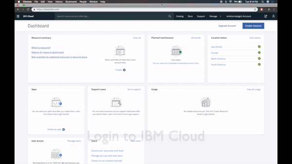

This Repository is a learning path to everything watson studio

# Creating a watson Studio Instance:

1. Register for IBM Cloud
2. Goto catalog and search for Watson Studio, listed under AI
3. Provision a lite Instance and click get started

Where to next?

[Running Jupyter Notebooks on watson studio](basicsofml.md)
* Classification on Iris
* MNIST classifier
* Regression for Real estate price prediction

[Consuming Watson Machine Learning Service](loaneligibility.md)

* Create a Loan eligibility Model

[Pixie Apps](recommendation.md)
* Build a shopping cart based recommendation engine

[Using Watson Model Builder](modelBuilder.md)
* Deploy heart attack prediction model

[Deep learning on Watson Studio](reverseim.md)
*  Building a reverse image search engine