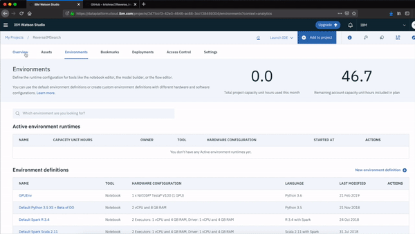

# Creating Notebookst:




### Note:
Tested on Python 2.7 with spark 2.0

* Run the below line of code to install 0.18 of scikitlearn


```
!pip install scikit-learn==0.18

```


# Classification

* **[Classification classification-12Liner](notebooks/classification_10Liner.ipynb)** consists of a shortened version of [IRIS](https://en.wikipedia.org/wiki/Iris_flower_data_set) classifier with no evaluation
* **[Classification Simple](notebooks/classification%20simple.ipynb)** outputs a related image basing on the classification of the flower
* **[Classification_Evaluation](notebooks/classification_Evaluation.ipynb)** contains the Complete version of Basic IRIS data classification along with performance evaluation and algorithm comparision
* **[MNIST Simple](notebooks/MNIST%20Simple.ipynb)** classifies random test images of hand written digits from [MNIST Dataset](http://yann.lecun.com/exdb/mnist/) into respective classes of 0-9

# Regression
* **[Regression_realestate](notebooks/Regression_realestate.ipynb)** uses Linear regression to predict Real estate prices based on a dataset included in **RealestateData.csv**
* **[Regression_tv](notebooks/Regression_tv.ipynb)** predicts which of the two Tv series flash or Arrow gets most veiwership based on the data from **veiwershipData.csv**

# Importing Notebooks onto DSX
* Navigate to [https://datascience.ibm.com/](https://datascience.ibm.com/) and Login with your IBM ID
* Create your project and Give it a Description
* Click on Add notebooks

### From From URL
* Copy the URL of the python notebook File
* Click on From ***URL Tab***
* Give your project a name and paste the copied url in Notebook URL Field

### From File

* Download the gitHub Repo
* Click on ***From File*** Tab
* Give your notebook a name and click browse button to import your ***.ipnyb file***

# Accessing DataFiles
* Click on ***add data assets*** from the project home screen
* Import your ***.csv*** data file
* From within the notebook, click the ***Find and add Data*** menu item on the top right
* Find your dataset and select ***Insert Pandas Dataframe***
* use the assigned Data variable which can be seen in the ***second-bottom most line*** of the inserted code
