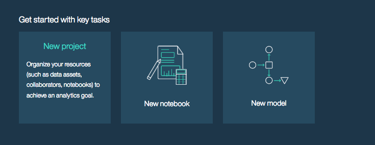
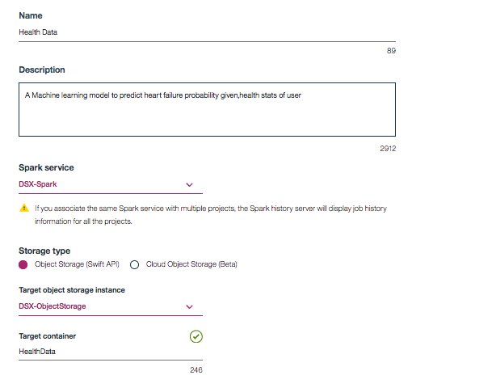
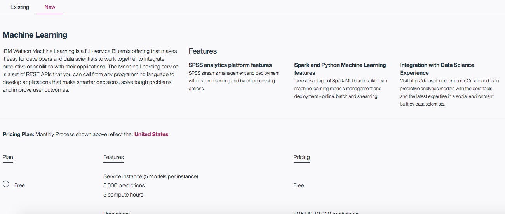
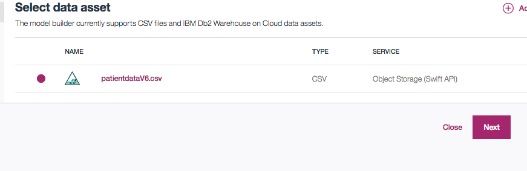
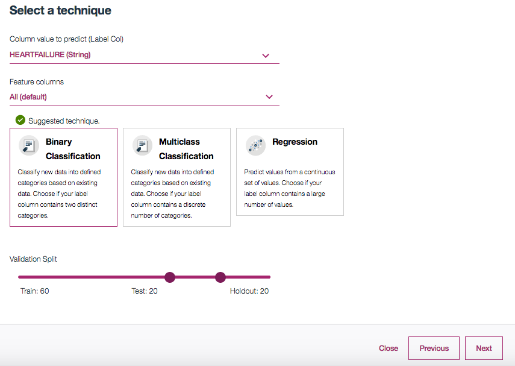
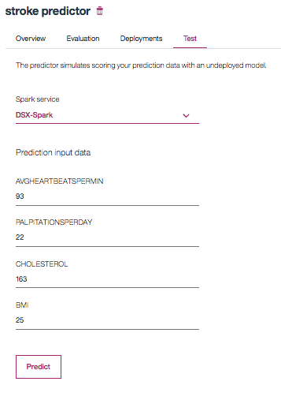

This repository demonstrates how to use IBM Data Science Experience Models feature to predict the probability of heart stroke, given the patient data

Step 1: Login to your [DSX account](https://dataplatform.ibm.com/) and click on Get Started, choose New Project

 
 Step 2: Name your project and give it a suitable description
 
 
 
 Step 3: Once the newly created project opens up, click on the settings tab.scroll down to Associated services menu and click add Service
 
 
 
 Step 4: Select Machine Learning service and add new machine learning service
 
 
 
 Step 5: Goto Add to project and select Model
 
 
 
  Step 6: Give it a name and select Automatic Model creation and click next
  
 
 
   Step 7: Now click on add dataset and upload the patientdataV6.csv file

 Step 8: Select the added dataset and click next
 
 
  Step 9: Select the HEARTFAILURE column as Label Column and ALL as Feature set and click next

  
  
  Step 10: Once training and Evaluating the model are done, a summary of the model is provided 

  
  
  
  Step 11: Save the model
   Step 12: Open the model and navigate to Test
   Step 13: Input the values you want to predict and click predict
  
  
  
 step 14: An output bar chart shows the probability of getting a stroke
  
    

  